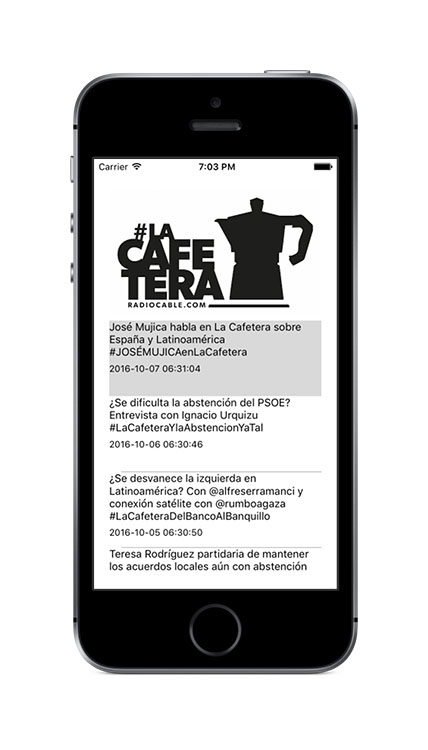

# APP La Cafetera - Xamarin

Prototipo de aplicación para smartphones para escuchar el programa La Cafetera alojado en [Spreaker](https://www.spreaker.com/show/lacafetera_1) usando [Xamarin](https://www.xamarin.com).

El objetivo de este prototipo es ver la viabilidad de Xamarin para desarrollar una applicación multiplataforma para La Cafetera.

Este prototipo debe ser capaz de ofrecer dos funcionalidades básicas:

* Obtener un listado de episodios de forma asíncrona.
* Reproducir en streaming cualquiera de ellos.
    
    
En esta página se encuentra la descripción sobre la API de Spreaker: [https://developers.spreaker.com/api/](https://developers.spreaker.com/api/)
  
  
  
*NOTA: El prototipo se encuentra en desarrollo y por el momento funciona correctamente para iOS a falta de cambiar las librerías de reproducción de audio para Android.*
  
